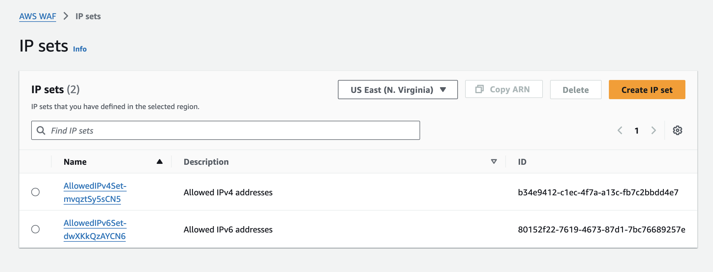
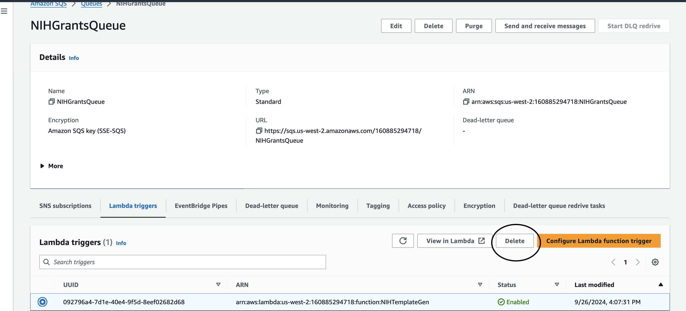

# NIH Grant Assistant CloudFormation Nested Stack

> **Note**: This is sample code for non-production usage. You should work with your security and legal teams to meet your organizational security, regulatory, and compliance requirements before deployment.

## Important Disclaimers
- The stack that these templates create are for demonstration purposes only
- It should be deployed in a non-production account
- The delete-script associated with the root stack will remove AWS services associated with it
- The Stack is restricted to a single region in each AWS account
- The Stack will create resources that will incur costs
- The latest Firefox browser is recommended for optimal experience
- We use GitHub Issues to track ideas, feedback, tasks, or bugs

# Contents
- [Architecture](#architecture)
- [Account Setup](#account-setup)
- [Enable Bedrock in a Region](#enable-bedrock-in-a-region)
- [Deployment](#deployment)
- [Post CloudFormation Steps](#post-cloudformation-steps)
- [Deleting the Stack](#deleting-the-stack)
- [Lambda Memory Sizing](#lambda-memory-sizing)
- [Accessing OpenSearch Dashboard](#accessing-opensearch-dashboard)
- [Operations](#operations)
- [Cost](#costs)
- [Errors](#errors)

# Architecture


# Account Setup
Either an IAM user with AdministratorAccess and console access or an Identity Center user with the AdministratorAccess permission set should be created.

# Enable Bedrock in a Region
1. Login to your AWS account that has the AdministratorAccess policy
2. From AWS Console, navigate to Bedrock
3. Select "Enable Selected Models" and enable only the Anthropic models
   
   

# Deployment
1. Login to your AWS account that has the AdministratorAccess policy
2. Enable access to all Anthropic models in Bedrock in the region you will be deploying in. The CloudFormation templates only allow for deployment in us-east-1 and us-west-2.
3. Create an S3 bucket in the REGION you will deploy the stack to (us-east-1 or us-west-2). An example bucket name would be `[AWS Account #]-researcher-cloudformation-bucket-[AWS REGION]`. Remember bucket names must be unique; adding your AWS account number and deployment region to the bucket name will help make it unique.
4. Upload all files from the `bucketfiles` directory in the git repo into the root of the bucket you created above.
5. From the CloudFormation console, deploy the `root.yaml` - see screenshots below.
6. Verify you are in the correct region!

> **Note**: Average time to deploy all stacks and for CodeBuild to finish is about 25 minutes.


### Create a new Stack


### Upload the root.yaml template from the repo


### Enter the Stack Details
Give the stack a name (e.g. genai-stack) and enter the bucket name you created earlier as parameters.


### Enter the Stack Options


### Acknowledge Stack Creation of Resources


### Wait for Stack to complete

# Post CloudFormation Steps 

## Check CodeBuild Status
It MUST complete before you can deploy the app to Amplify.

1. From AWS Console, navigate to CodeBuild
2. Select Build Projects in left Navigation bar
3. Click on the build project name
4. You must see the following in order to proceed - both projects need to be successful

   

## Modify WAF IP Address or Delete the Rule
The default setup comes with a WAF IP Set and Rule that only allows a default IPv4 and IPv6 to access Amplify. You must add your IPs to the Set or you can delete the WAF Rule and allow all IPs if your security team approves.

### To Delete the Rule:
1. Go to Web ACLs, click on rule and disassociate from the service, then you can delete the rule
2. From AWS Console, navigate to WAF & Shield

   
   
   

### To Modify the IP Set:
> **Important**: Some ISPs use IPv4 and some use IPv6, so you might want to change both. Also, being on a VPN can obfuscate your public IP.

1. From AWS Console, navigate to WAF & Shield
2. Select IP Sets in left Navigation bar
3. Click on BlockIPSet

   
   
4. Find your public IP address and add it using correct format like `99.234.54.13/32`

   

## Deploy UI
1. Download `nih-bot-amplify-build.zip` from the S3 bucket you created initially that has the template files in it
2. Navigate to Amplify in the AWS console and create new app
3. Deploy without GIT

   
   
4. Keep default app Name and branch Name 

   
   
5. Choose `nih-bot-amplify-build.zip` from your local computer

   
   
   
6. Once it is uploaded, deployment will begin. When you see the green Deployed, click on the link under Domain.

   

## Create a Cognito Account User
Cognito is used for Authentication of the Amplify App.


### Verify user with code from email
**IMPORTANT**: At this step, you will not get a code emailed to you for security reasons, and an AWS Admin MUST manually confirm the user.

The Admin should:
1. Go to Cognito
2. Click on the User pool created
3. On the left side, click "Users"
4. Confirm the recently created user

   
   

Once this is done, the user can refresh the page and login into the app. You will be asked to verify your Account Recovery email, and a code will then be sent to that email for verification. After entering the code and verifying, the app will appear.

## Exercise the Application with Your Data


## Test the UI with Grants Data
The GitHub repo has a test-files directory with files related to NIH-Grant PAR-23-025.

1. Start by searching on PAR-23-025 and follow the screenshots below to generate a grant template
2. **Note**: Generation can take up to 10 minutes
3. Once it is complete, click the Template Download link and review the generated grant
   
   > **IMPORTANT**: The presigned URL link will only last 15 minutes


## Test the Generic Path
The UI defaults to the **NIH Research** path described above, but there is also a **Generic Path** that can be selected.

This path allows for simple Retrieval Augmented Generation (RAG) capability:
- You can upload one or more files and have the content of those files included in a prompt that you create yourself
- This is meant to help you with sections of the NIH Grant proposal or AIMs document but can be used more generically as well
- To use the uploaded content, you must include this sentence in your prompt: **Start this task by carefully reviewing the content between the \<docs\> tags that follow \<docs\> {docs} \</docs\>.**


# Operations
## Available Grants Uploading

1. The initial install loads grants based on a default filter. If you want to change the grants to suit your research needs, the below instructions will guide you.
2. In a browser, go to https://grants.nih.gov/funding/searchguide/index.html#/
3. Select Advanced Search
4. In Funding Organizations, select NIH and AHRQ or your Orgs
5. Select the Activities that you need
6. Select the Funding Types that you need
7. Release Date 01/02/2019 or as desired - Current Day update each day
8. Filter by any other categories of interest
9. Export the xlsx file locally
10. Open xlsx and save as csv file
11. Upload csv to folder the context bucket under available-grants/AllGuideResultsReport
12. Verify lambda is triggered and grants get uploaded to opensearch collection by viewing the /aws/lambda/NIHGrantLoader log group

The current grants csv file came from the below search filter:


# Deleting the Stack
Before deleting the root stack, some resources need to be removed. You can do this from the console or from a provided script.

## From the console, perform the following:

### 1. Delete all containers from ECR and then delete the repository


### 2. Empty the context bucket and then delete the bucket


### 3. Delete lambda trigger on Queue and then Delete SQS Queue
> Note: This will take a minute or two, so wait for it to complete





### 4. Delete NIHTemplateGen Lambda Function


### 5. Delete Amplify App


### 6. NOW you can delete the root stack 😊


## Using the CLI Script
If you have experience with the AWS CLI, there is a script under `/documentation/scripts` in the repo that will perform these steps.

The requirements for running the script are in the comment section at the top of `pre-delete-stack.sh`. Once you have satisfied those requirements, set your AWS environment and run `pre-delete-stack.sh` from a bash shell.


# Lambda Memory Sizing
The memory size for all Lambda Functions is set to 3008 MB. You should increase these for TextTract and Bedrock Lambdas to 8019 MB for better performance.

# Accessing OpenSearch Dashboard
To access OpenSearch Dashboard, edit "Data access policies" for the "Access policy name" called quickstart-access-policy. For the "Selected Principals" add the role `role/aws-reserved/sso.amazonaws.com/AWSReservedSSO_AWSAdministratorAccess_xxxxxxx` where this matches your Identity Center user.

# Model Access
Models that can be used include (replace the MODEL_ID Environment Variable in NIHTemplateGen):

- `anthropic.claude-3-haiku-20240307-v1:0`
- `amazon.nova-pro-v1:0`
- `nova-lite-v1:0`
- `arn:aws:bedrock:us-east-1:376129841173:inference-profile/us.anthropic.claude-3-7-sonnet-20250219-v1:0`
- `arn:aws:bedrock:us-west-2:376129841173:inference-profile/us.anthropic.claude-3-7-sonnet-20250219-v1:0`
- `arn:aws:bedrock:us-east-1:376129841173:inference-profile/us.anthropic.claude-3-5-haiku-20241022-v1:0`
- `arn:aws:bedrock:us-west-2:376129841173:inference-profile/us.anthropic.claude-3-5-haiku-20241022-v1:0`

# Costs
A rough estimate for running the AI and associated services in AWS is $20-25 per day.


# Errors
> "Everything fails, all the time!" - Werner Vogels 😠

Below are some common errors we have seen:

## Error - The bucket you are attempting to access must be addressed using the specified endpoint
- Bucket you created is in a different region than where you are deploying

## Error - Unable to get Region Mapping

- This stack can only be deployed in us-west-2 or us-east-1

## Error - S3 Access Denied

- The bucket name you provided in the Stack Details is wrong

## Error - Failed to Create

- You are attempting to deploy but some resources already exist like an Elastic Container Repository, a Lambda Function, an SQS Queue, or the S3 Context Bucket

## Error in GrantLoader Lambda
```
{
    "level": "ERROR",
    "location": "lambda_handler:111",
    "message": "Exception thrown adding to index str(TransportError(500, 'exception', 'Internal error occurred while processing request'))",
    "timestamp": "2024-10-31 18:01:09,381+0000",
    "service": "service_undefined",
    "xray_trace_id": "1-6723c5cd-429c18467ebdee14000594e6"
}
```
- Rerun lambda by dropping csv file into the correct folder

## Error in InvokeModel
- `(AccessDeniedException) when calling the InvokeModel operation`
- You have not provided access to the Bedrock Model. Modify access and run again.

## WebSocket Error
This can happen for various reasons, usually due to a bad network connection on the client. These are usually transient.

- `Uncaught (in promise) NetworkError: A network error has occurred.`
- Or socket closed error messages with details about WebSocket connection issues
- When your network connection improves, try again

## Error in Document Formatting
- The model is responsible for HTML formatting. Sometimes this doesn't happen cleanly even though the content is there. Run again if this happens.

## Error: Input Tokens Exceeded
- If you submit too many documents to the model for any of the prompts, or if the size of all the documents exceeds the input tokens allowed by the model, you will receive this error. Reduce your documents and try again.

## Error: Download Link Has Expired
```xml
<Error>
<Code>AccessDenied</Code>
<Message>Request has expired</Message>
<X-Amz-Expires>900</X-Amz-Expires>
<Expires>2025-04-11T11:07:04Z</Expires>
<ServerTime>2025-04-11T11:09:31Z</ServerTime>
<RequestId>5GPKTPCJDNX267FN</RequestId>
<HostId>
fUQYcF3YR+2k3K9Tpfv+AA+YRYzQpqmBlyD9wqb3erZ3jIUYL0SZuXqKZL/dcE/CbNPEUhOCuoQ=
</HostId>
</Error>
```
- Download links only last 15 minutes